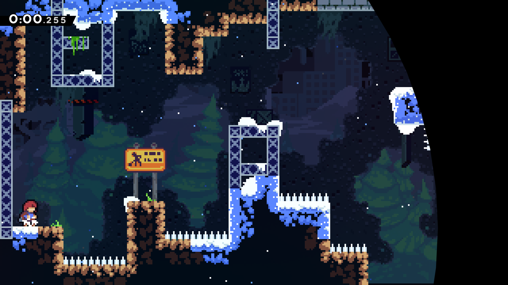
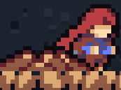

# AutoSplitr

**AutoSplitr** is an [OpenCV](https://opencv.org/) based Speedrun Splitter : it aims to recognize certain images while playing a game in order to 'split' to the next timer segment.

Basically, you pick screenshots of where your splits take place (for example by using a video from an old run) and store them somewhere you like (I recommend a folder per category and/or game). Images inside a given folder will be sequentially compared to what's going on on the screen.

As of today, AutoSplitr only supports [LiveSplit One](https://one.livesplit.org); it acts as a server for LiveSplit to connect, using the 'Connect to server' button. Using a self-signed TLS certificate, any device (on the same network as the server) can link to AutoSplitr; hence, if you don't have a multi-monitor setup, you can use your phone's mobile browser to launch LiveSplit One and track your splits. Of course, you can use 'localhost' to view your splits on the same machine.

# How-to

## First steps

* Install AutoSplitr ! It is just a bunch of pyhton scripts, but we need to install its dependencies. The `install.sh` script can do that for you.

* Take screenshots of your game using any tool. **Be careful**, AutoSplitr needs to compare pictures of the same size, ie. your splits will be valid for a given resolution and aspect ratio only. For example, if you take screenshots of a game on a fullscreen 1920x1080 monitor, you won't be able to use them on a 1024x768 screen or played on a floating window.
	* Two comparisons methods are supported :
		* [Structural Similarity](https://en.wikipedia.org/wiki/Structural_similarity), which compare two exactly same-sized images
		* [TemplateMatching](https://docs.opencv.org/3.4/de/da9/tutorial_template_matching.html), that allows to search for a small image inside a bigger one ; here, we search for a small portion of the game screen (say, the Star counter indicating 'x10' stars in Super Mario 64) inside the full capture frame : thus, we are able to detect precisely timed splits
	* To be able to distinguish both methods easily, you have to follow this naming convention for your splits :
		* `<NB><TYPE><NAME>.<EXT>`, with:
			* `<NB>` is a 3 digit number, ie 000, 001... that increments in the order of the run
			* `<TYPE>` is either `-`, meaning SSIM is used (full screen comparison) or `=`, meaning it is a cropped picture to compare.
			* `<NAME>` is a bunch of characters for you to remember what the image is (not used by AutoSplitr)
			* `<EXT>` should be any supported image extension (png, jpg, bmp...)
		* Thus, those are valid splits names :
			* `000-Run start.png`    (first split of the run indicated by 000 ; the `-` means that you want a full picture comparison for it; ie you just took a screenshot of your whole game screen)
			* `001=First checkpoint.png`    (the `=` means that you have cropped the screenshot because you want to split on an event that occurs on a small portion of the game window)
	* **For a step by step tutorial, refer to the section "Example" below !**

* Setup `settings.cfg`. It is a json file containing useful settings ; here is what it looks like :
```
{
	"splitsPath":"/path/to/splits/folder/",
	"splitsExt":"png",
	"captureFullscreen":1,
	"gameWindow":"GameWindowName",
	"monitorIndex":0,
	"server":1,
	"useSsl":1,
	"sslLoc":"/path/to/folder/containing/selfsigned/certificates/",
	"ip":"auto",
	"port":8000,
	"verbose":1,
	"ultraVerbose":0
}
```
	
| Setting name      | Default value             | Description                                                                                                                 |
|-------------------|---------------------------|-----------------------------------------------------------------------------------------------------------------------------|
| splitsPath        | "/path/to/splits/folder/" | where to look for your splits pictures defined earlier                                                                      |
| splitsExt         | "png"                     | extension of your splits : png, bmp, jpg...                                                                                 |
| captureFullscreen | 1                         | if set to 1, capture your whole screen ; else, try to locate your game window                                               |
| gameWindow        | "GameWindowName"          | window name to search for if `captureFullscreen` is set to 1.                                                               |
| monitorIndex      | 0                         | if using multi-monitor setup, screen to capture. 0 is your default monitor.                                                 |
| server            | 1                         | should start the WebSocket server for LiveSplit One to connect                                                              |
| useSsl            | 1                         | is set to 1, the server will look for self-signed certificates to connect from other devices (see next section)             |
| sslLoc            | "/path/to/folder/"        | path to the folder containing 'cert.pem' and 'key.pem'                                                                      |
| ip                | "auto"                    | you can set it to `"localhost"` (local timer) or `"auto"` (mandatory if `useSsl` is set to 1)                               |
| port              | 8000                      | port number for the server                                                                                                  |
| verbose           | 1                         | communicate some debugging values and say when a split is encountered when set to 1.                                        |
| ultraVerbose      | 0                         | tell similarity score at each frame if set to 1. This will slow down processing, but I'm sure it will be useful to someone. |

* Start AutoSplitr : `python3 splitr.py`
	* There are a few arguments that can be passed to AutoSplitr on startup :
		* `--settings=/path/to/settings.cfg`, that allow you to use different settings files for different games (other monitor, different aspect ratio...) ; you can give the settings file the name you want, as long as it ends with `.cfg`.
		* `--splits=/path/to/splitsfolder/` : you can specify a folder containing your splits ; this will override the `splitsPath` setting, and enable the use of a single settings.cfg file for multiple games.

* Connect to the address told by the script using [LiveSplit One](https://one.livesplit.org) `Connect to Server` button ; it starts with "ws://" or "wss://" if you are using ssl for other devices to connect.

* Speedrun and enjoy your autosplits!

## Connecting


### If you want to view your splits on the same computer that run AutoSplitr,

then you don't have to go through this ~~pain~~ chapter ! You just have to set `ip` to `"localhost"` and `useSsl` to `0` !

### If you want to use another device (say, a phone), generate self signed certificated. This step is required only once.
Open up a terminal and paste the following :

>openssl req -x509 -newkey rsa:4096 -keyout key.pem -out cert.pem -days 365

Some infos will be asked for the certificate, but you don't really care since only you will use it; enter them anyway.
Two files, `cert.pem` and `key.pem`, will be created. Put them somewhere near AutoSplitr.
Change `settings.cfg` with `useSsl` set to `1` and the correct path besides `sslLoc` to the folder containing the generated files.

Finally, start AutoSplitr.

#### Then, for the first SSL usage by a given device and browser :

As usual when `server` is set to `1` in `settings.cfg`, an address will be displayed, say `wss://192.128.1.12:8000` as an example.

Connect to `https://(ip):(port)` , so `https://192.168.1.12:8000` in our example.

Click on "Advanced", then "Accept the risk".

You will have a blank page with the message : `This service requires use of the WebSocket protocol.` Exit this tab.

Restart the python script (doing the step above made it crash :) )

You are ready to connect using the last step below.

### Connecting with LiveSplit One !

Finally, go to [https://one.livesplit.org](https://one.livesplit.org) and connect to server (with the `ws` or `wss` address that AutoSplitr gives you). You can start to play !

## Example

Let's say that you want to speedrun Chapter 1 of the game [Celeste](http://www.celestegame.com/).

First, we need to define our starting split, ie. the frame that will start the timer. I took the screenshot below while playing on fullscreen (resized on the README, but it is a 1920x1080 image for my monitor) :



I name this frame `000-Chapter1-Entrance.png` : 000 since this is the first picture to detect and `-` since I want it to compare a fullscreen image. `Chapter1-Entrance` is just the name I want to give to this comparison.

I took some other screenshots (see the "examples" folder on this repo) of the fullscreen game.

The last split of the first chapter is when we reach the top of the moutain ; but the run is actually over when Madeline reaches the small campfire to the right. So, i took a screenshot then cropped it using GIMP :



Here, be sure that you only crop the image, and not resize it : the aspect-ratio should not change, or the comparison will always fail.

I named this frame `003=Chapter1-Exit.png`, with an equal sign `=` to specify that it is a cropped image to compare.

Then, I place all those splits in a folder; I named it "Celeste - Chapter 1".

Finally, I made a small script to quickly locate this folder and the settings for Celeste :

```
#!/bin/bash

python3 /home/user/xxx/splitr.py --settings=/home/xxx/settings.cfg --splits='/home/xxx/Speedrun/splits/Celeste - Chapter 1'
```


## Troubleshooting

* While connecting, I get the message `"This operation is insecure"` and I can't connect? But I'm sure that I've typed in the right address !
	* If you are connecting with the same device that runs AutoSplitr, set `useSsl` to `0` and `ip` to `"localhost"` ; then, connect LiveSplit One with the address `ws://127.0.0.1:8000` (or whatever port you defined).
	* If you are connecting with another device, refer to the section above to generate self-signed certificates ; this operation has to be done only once.


## TODO

- Profile CPU usage and improve it !! Today, AutoSplitr captures the game too fast/in a too resource-demanding way. Also, to detect a reset, it is comparing the current frame 1) to the comparison, and 2) to the first comparison 
- Delay splits from txt file (eg 001 +0.3s)
- Custom comparison thresholds for splits ?
- Better thread management and monitoring


## Used libraries

* [MSS](https://python-mss.readthedocs.io/) to capture the screen
* [OpenCV](https://github.com/opencv/opencv/) and [NumPy](https://numpy.org/) to process images
* [SimpleWebSocketServer](https://github.com/dpallot/simple-websocket-server/) to host a server for LiveSplitOne to connect


